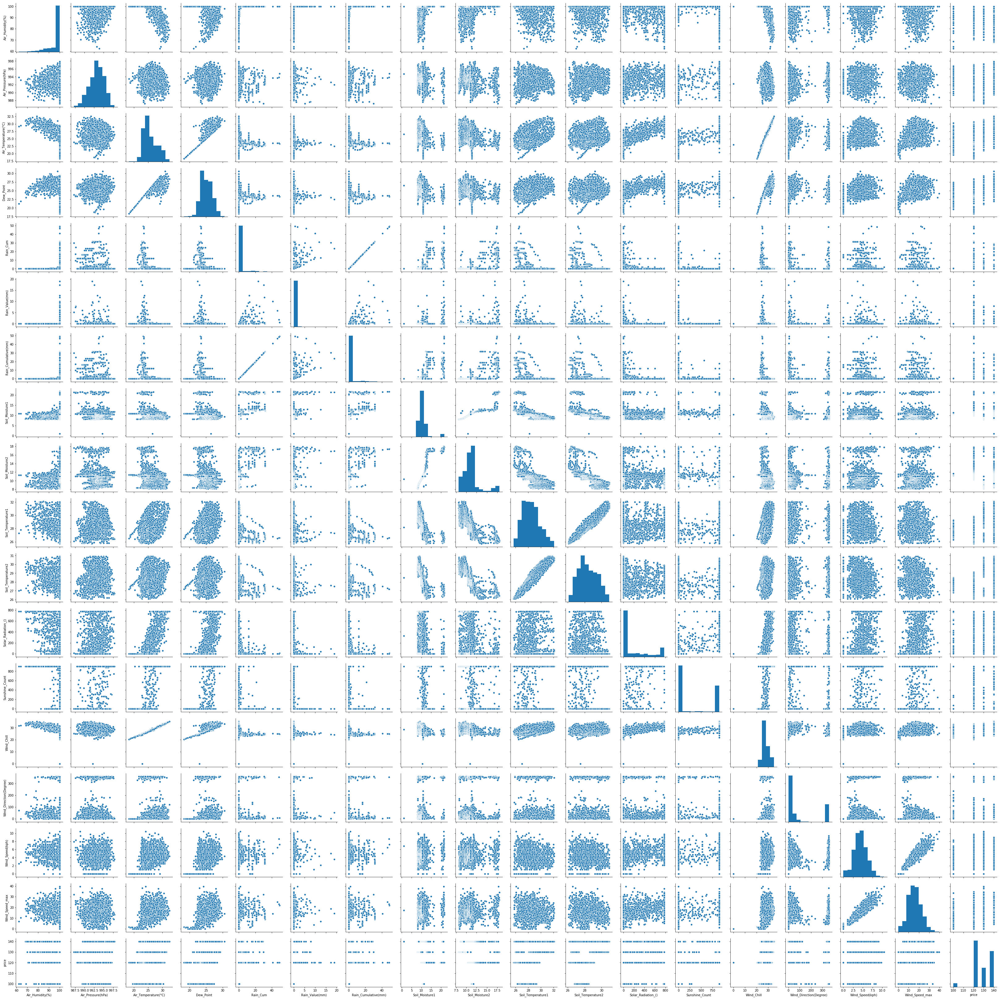
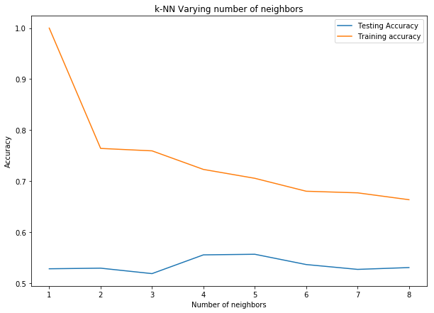
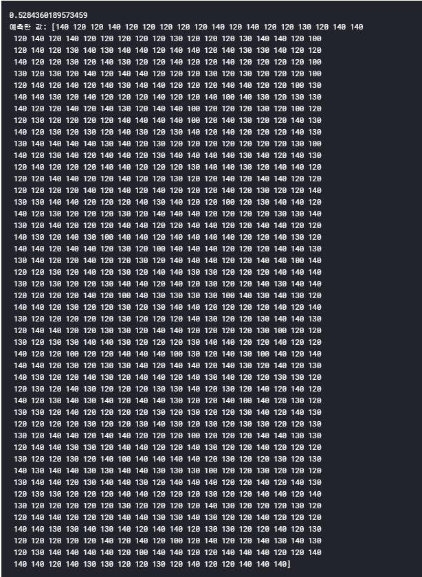
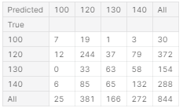

# 환경 기후 데이터 및 해당 과일 가격

- 환경 데이터로 과일 가격 예측하기

## 과정

1. 환경에 관한 데이터를 가져옵니다.
2. 데이터 분석합니다.
3. 학습시키고 예측합니다.

### HISTOGRAM

환경들을 히스토그램을 이용해 만들었습니다.

### HEATMAP

히트맵을 통해 각 컬럼 별로 얼마나 관계가 깊은지 확인했습니다.

### 학습 및 예측

예측

결과 테이블

